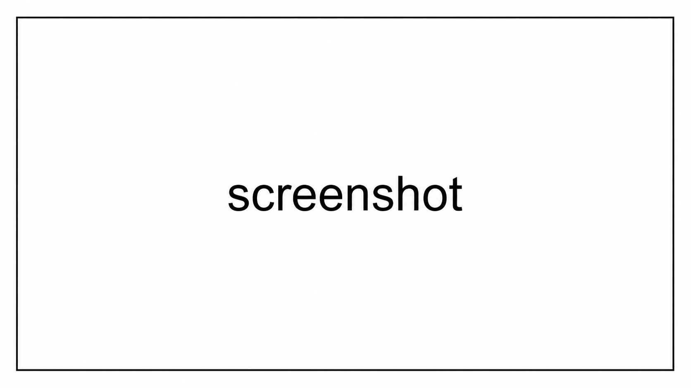

<!-- AI may update existing content; add or remove content only when requested. -->

# {PROJECT_NAME}

## Images

### Screenshots

## Demo

* [{demo_url}]({demo_url})

## Table of Contents

**Completed:** A1. Open Account ✓ — Account button → Account dialogue → Back.

1. [Live Demo](#live-demo)
2. [Getting Started](#getting-started)
3. [Project Overview](#project-overview)
4. [Project Details](#project-details)
5. [Troubleshooting](#troubleshooting)
6. [Resources](#resources)
7. [Credits](#credits)

## Getting Started

With Node.js 24 or newer installed, run `npm ci`, then `npm run dev`. Open the printed localhost URL. The host HTML is `packages/integration-demo/index.html`; serve it through Vite rather than opening the source as a file URL.

### Build Project

1. Run `{command}`.

### Run Project

1. Run `{command}`.

### Release version

1. Run `{command}`.

## Project Overview

Here is the project overview...

Signet-only, Arkade-only integration with no custom application server. The separate game remains playable without an account. Real transaction outcomes only.

### Configuration

React 19.2.8 + TypeScript, npm workspaces, and Vite. React was verified against the npm latest tag when this slice was created. The official Arkade SDK (`@arkade-os/sdk` 0.4.67) creates genuine Signet wallets in `packages/integration`. The integration owns encrypted browser persistence; recovery material never enters public state or events. No payments or funding run.

### Dependencies

- `PROJECT_NAME/package.json`: Lists dependencies and scripts.

### Documentation

- `README.md`: Primary documentation for this repo.

### Configuration

- Any config details..

### Structure

- `PROJECT_NAME`: Main project folder.
- `packages/integration/src/`: public entry point, production UI, and reserved core/Arkade boundaries.
- `packages/integration-demo/src/`: admin panel, portrait preview, and split-screen composition.
- `documentation/images/`: screenshot and banner assets.
- `.openspec/`: specification configuration.
- `.agents/skills/`: OpenSpec workflows.

## Project Details

### AI

- [Codex](https://openai.com/codex/): The best way to build with agents.
- [OpenSpec](https://openspec.dev/): Specification-driven development

### Editors

- [Visual Studio Code](https://code.visualstudio.com/): The open source AI code editor.

### Packages

- [Vite](https://vite.dev/): JavaScript bundling and local dev server.

## Resources

- [Best Practices](https://www.SamuelAsherRivello.com/best-practices/)
- [OpenSpec](https://openspec.dev/)

## Credits

### Created By

- Samuel Asher Rivello
- Over 25 years of game development experience as of 2026

### Contact

- ⭐ LinkedIn: [LinkedIn.com/in/SamuelAsherRivello](https://Linkedin.com/in/SamuelAsherRivello)
- Git: [GitHub.com/SamuelAsherRivello](https://github.com/SamuelAsherRivello/)
- Resume and Portfolio: [SamuelAsherRivello.com](http://www.SamuelAsherRivello.com)
- Twitter: [Twitter.com/srivello](https://twitter.com/srivello/)

### License

Provided as-is under the [MIT License](LICENSE).
Copyright © 2026 Rivello Multimedia Consulting, LLC.
