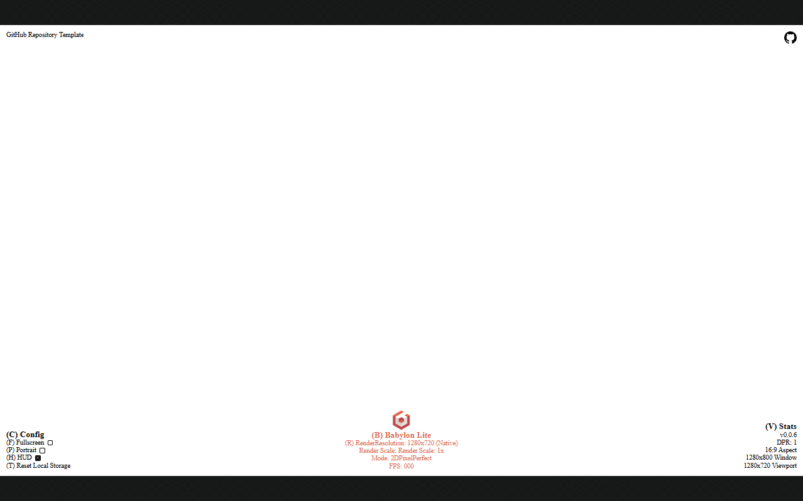

<!-- AI: Keep commands rooted at the repository. The Vite application, source, tests, and build output belong in project-name/. Work within the following HTML template -->
<a href="project-name/documentation/samuel-asher-rivello-banner.png)"></a>
<BR>

# {project-name}

<!-- AI: Do not add more than one sentence of introductory text at the top of this section. -->

<!-- AI: Update this project summary when the template is used. -->
This is the project repo....

## Original AI Prompt

<!-- AI: Populate with the the earliest substantive user prompt that started this project. Replace the placeholder within the <details> below with the original prompt text. -->

<details>
<summary>Read the full original prompt</summary>

```text

Create a new project from this template.

Type: {App | Game}
Orientation: {Portrait | Landscape}

Project description:
{Describe the app or game, including its core purpose and important features.}

For games:
Rendering: {2D Pixel Perfect | 3D}

```

</details>

## Live Demo

<!-- AI: Keep exactly one bullet containing the demo link and no other visible text. Do not mention releases or add other text here. Keep this one link updated to the latest release URL. -->

- [{live-demo-url}](https://samuelasherrivello.github.io/github-repository-template/)


## Images

<!-- AI: Do not add more than one sentence of introductory text at the top of this section. Work within the following HTML template -->

<a href="project-name/documentation/screenshot01.png"></a>

## Table of Contents

<!-- AI: Do not add more than one sentence of introductory text at the top of this section. -->

<!-- AI: Do not include anything above the Table of Contents within the Table of Contents. -->
1. [Getting Started](#getting-started)
2. [Project Details](#project-details)
3. [Optional AI Skills](#optional-ai-skills)
4. [Credits](#credits)

## Getting Started

<!-- AI: Do not add more than one sentence of introductory text at the top of this section. -->

<!-- AI: Update this getting-started summary when the template is used. -->
This is the getting started...

### 🛠 Build Project

<!-- AI: Do not add more than one sentence of introductory text at the top of this section. -->

1. From the repository root, run `npm install`.
2. Run `npm run build`.

### 🛠 Run Project

<!-- AI: Do not add more than one sentence of introductory text at the top of this section. -->

1. From the repository root, run `npm run dev` and open the localhost URL Vite prints.
2. Run `npm test` to execute the focused source checks.

### 🛠 Release Version

<!-- AI: Do not add more than one sentence of introductory text at the top of this section. -->

1. Run `npm test` and `npm run build` from the repository root.
2. Push to `main` to deploy through the GitHub Pages workflow.
3. Run the **Release** workflow from GitHub Actions to bump the patch version, tag it, and create the GitHub release.

## Project Details

<!-- AI: Do not add more than one sentence of introductory text at the top of this section. -->

<!-- AI: Update these project details when the template is used. -->
This is the project details...

### 📝 Structure

<!-- AI: Do not add more than one sentence of introductory text at the top of this section. -->

- `project-name/index.html` mounts the React browser surface; `project-name/src/` contains viewport, gutter, content, and UI composition.
- [Layout and game integration](project-name/documentation/layout-and-game-integration.md) documents viewport configuration, the implemented Babylon Lite showcase, and guidance for adapting the content layer to a game or app.
- `project-name/test/` contains focused automated checks for the starter.
- `project-name/documentation/` contains canonical README images and project
  documentation assets.

### 📦 AI

<!-- AI: Do not add more than one sentence of introductory text at the top of this section. -->

- `AGENTS.md` contains repository-specific AI agent guidance.
- `AGENTS_TEMPLATE_USAGE_CHECKLIST.md` contains the template reuse checklist.
- [openspec](openspec/) contains the repository's specification workflow
  configuration.

## Optional AI Skills

Skills are not bundled by default. Keep skills in global storage when they are
part of an individual's workflow; add a project-local skill only when the
project depends on that skill and collaborators or automation need the same
capability. Before adding one, check its license, maintenance status, and
whether it introduces generated files or additional setup.

These repositories are possible sources for optional skills:

- [ai-skills-library](https://github.com/SamuelAsherRivello/ai-skills-library/) -
  general-purpose skills.
- [ai-skills-tiled](https://github.com/SamuelAsherRivello/ai-skills-tiled/) -
  Tiled-focused skills.
- [ai-skills-blender](https://github.com/SamuelAsherRivello/ai-skills-blender) -
  Blender-focused skills.

Humans should choose and install only the relevant skill using their AI tool's
normal skill-installation mechanism. AI agents should first follow the
repository's `AGENTS.md`, then use an available global skill, and finally use
a project-local skill when the repository explicitly includes or requires one.
Do not assume that a link alone installs or activates a skill.

### 📦 Packages

<!-- AI: Do not add more than one sentence of introductory text at the top of this section. -->

- [Vite](https://vite.dev/) provides local development and production builds.

## Credits

<!-- AI: Do not add more than one sentence of introductory text at the top of this section. -->

<!-- AI: Preserve established attribution and ownership. Customize the following subsections only from confirmed contributor, contact, and license information; do not infer a new owner from the repository name. -->
### 💡 Contributors

<!-- AI: Do not add more than one sentence of introductory text at the top of this section. -->

<!-- AI: Preserve existing contributor credit and add contributors only when confirmed. Do not automatically advance experience counts or their reference year. -->
- Samuel Asher Rivello - Over 25 years of game development XP (2026)

### 💡 Contact

<!-- AI: Do not add more than one sentence of introductory text at the top of this section. -->

<!-- AI: Preserve confirmed contact destinations and their order unless requested otherwise. Use readable display URLs without a protocol or trailing slash while keeping the real link target intact. Do not invent accounts or change target capitalization based on display styling. -->
- [LinkedIn.com/in/SamuelAsherRivello](https://Linkedin.com/in/SamuelAsherRivello) ⭐ 
- [GitHub.com/SamuelAsherRivello](https://github.com/SamuelAsherRivello/)
- [Twitter.com/srivello](https://twitter.com/srivello/)
- Resume / Portfolio: [SamuelAsherRivello.com](http://www.SamuelAsherRivello.com)


### 💡 License

<!-- AI: Do not add more than one sentence of introductory text at the top of this section. -->

<!-- AI: Keep the license name linked to the actual relative license file and verify that its terms match this statement. Keep the copyright holder and year consistent with that file. Do not change license terms, ownership, or dates without an explicit request. -->
- Provided as-is under the [MIT License](LICENSE).

- Copyright © 2026 Rivello Multimedia Consulting, LLC.
